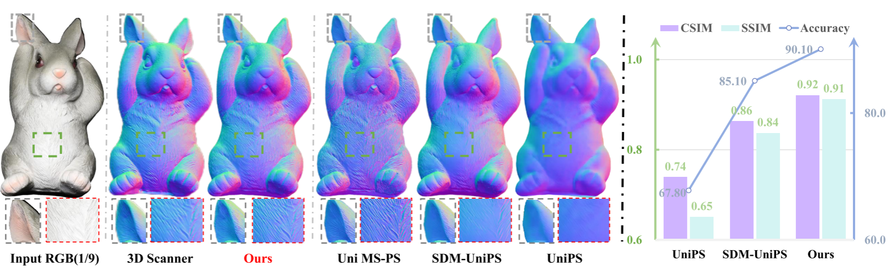
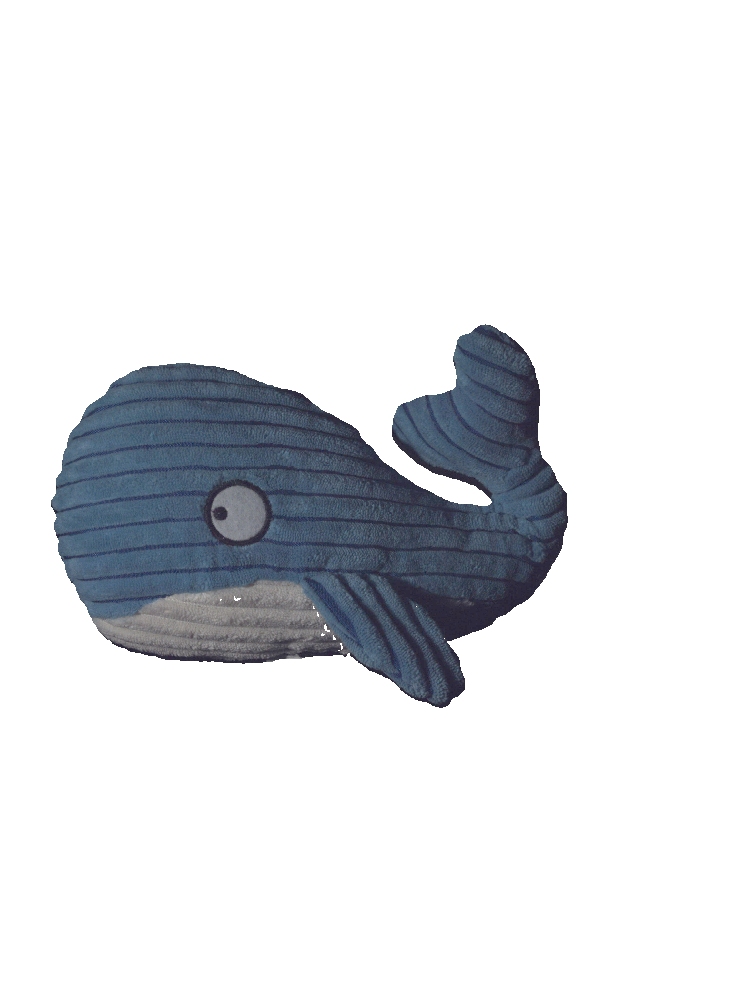
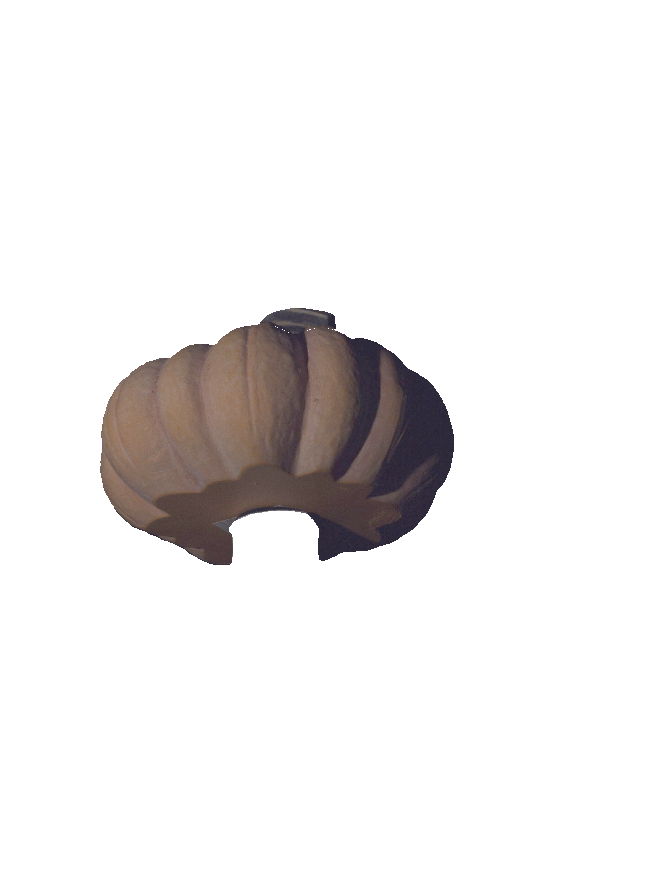
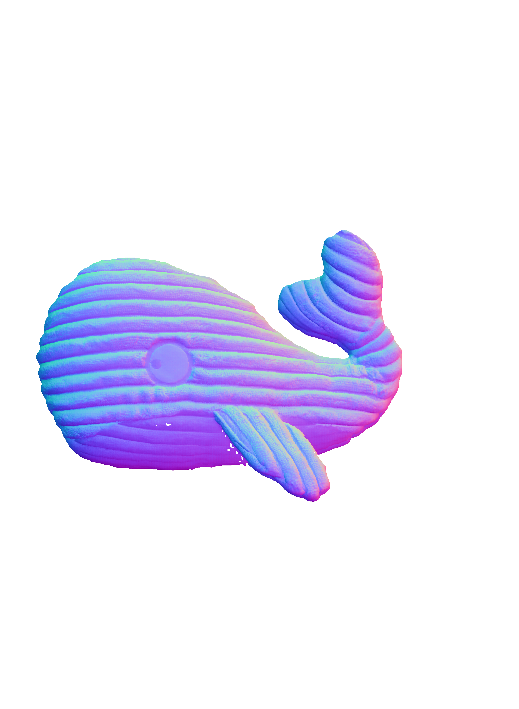
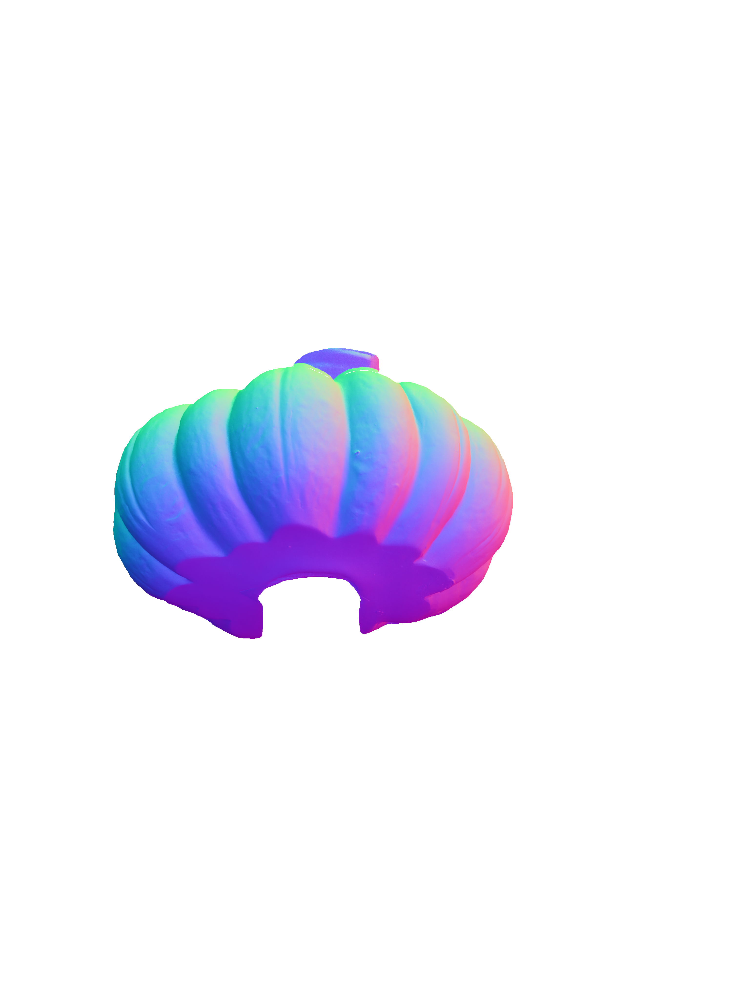
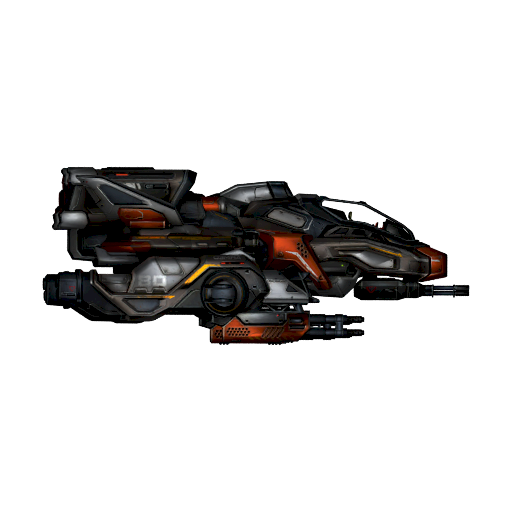
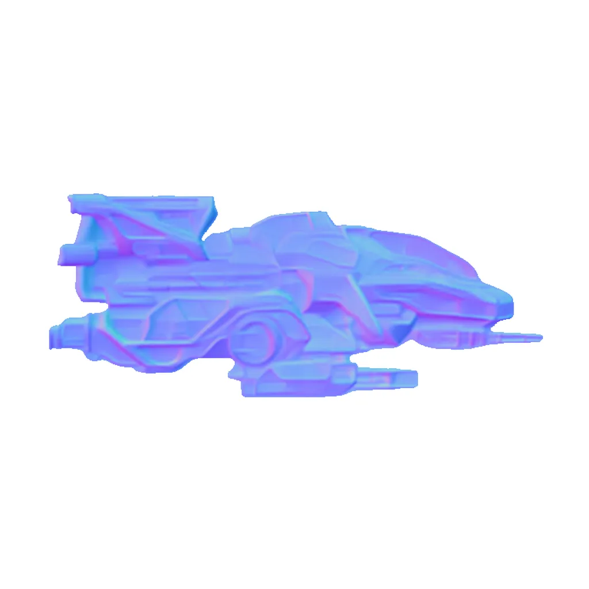
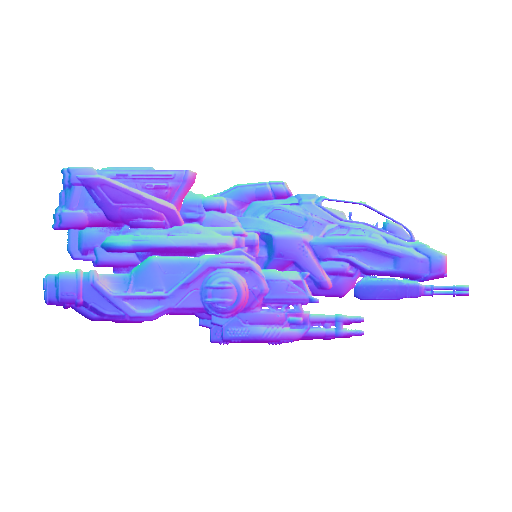
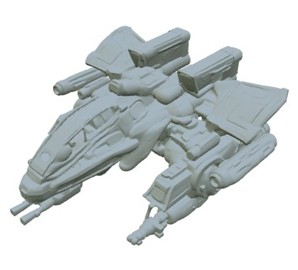

<div align="center">
<h1>Light of Normals: Unified Feature Representation for Universal Photometric Stereo</h1>

<a href="https://houyuanchen111.github.io/lino.github.io/"></a>
<a href="https://arxiv.org/pdf/2506.18882"></a>
<a href="https://huggingface.co/houyuanchen/lino"></a>
<a href="https://huggingface.co/spaces/houyuanchen/lino"></a>


[Hong Li](https://scholar.google.com/citations?user=5FBYzP8AAAAJ&hl=en)\*, [Houyuan Chen](https://github.com/houyuanchen111)\*, [Chongjie Ye](https://github.com/hugoycj)$^\dagger$
<br>
[Zhaoxi Chen](https://frozenburning.github.io/), [Bohan Li](https://arlo0o.github.io/libohan.github.io/), [Shaocong Xu](https://daniellli.github.io/),[Xianda Guo](https://xiandaguo.net/)
<br>
[Xuhui Liu](https://scholar.google.com.hk/citations?user=d4Dg1J4AAAAJ&hl=zh-CN), [Yikai Wang](https://scholar.google.com/citations?user=MnW5aegAAAAJ&hl=pl), [Baochang Zhang](https://scholar.google.com/citations?user=ImJz6MsAAAAJ&hl=zh-CN), [Satoshi Ikehata](https://satoshi-ikehata.github.io/), [Boxin Shi](https://scholar.google.com/citations?user=K1LjZxcAAAAJ&hl=en), [Anyi Rao](https://anyirao.com/), [Hao Zhao](https://scholar.google.com.hk/citations?user=ygQznUQAAAAJ&hl=en)$^\ddagger$ 
<br>
\* Equal contribution $^\dagger$ Part of project lead $^\ddagger$ Corresponding author
<br>


</div>

<p align="center">
  
</p>


# 📊 Overview

`LINO-UniPS` is a method for `Univeral Photometric Stereo (PS)`. It predicts the normal map from a given set of images. Key features include:
* **Light-Agnostic:** Does not require specific lighting parameters as input.
* **Arbitrary-Resolution:** Supports inputs of any resolution.
* **Mask-Free:** Also supports mask-free scene normal reconstruction.

# ✨ News

- June 2025 - Release paper, project page, Hugging Face demo and model checkpoint. 

# 📝 TODO List

- [x] ~~Release checkpoint and inference code.~~
- [ ] Release `PS-Verse`, the training dataset.
- [ ] Release training code.
- [ ] Adding support for PBR material estimation.
# 🔛 Get Started 
### 💾 Installation

```bash
git clone https://github.com/houyuanchen111/lino.git
cd lino
conda create -n LINO python=3.10
conda activate LINO
pip install -r requirements.txt
```

### 📝 Dataset Preparation
Download the following benchmarks for evaluate our LiNO-UniPS.
* [DiLiGenT](https://drive.google.com/open?id=1EgC3x8daOWL4uQmc6c4nXVe4mdAMJVfg): A widely-used benchmark for photometric stereo, consisting of 10 real-world objects with diverse shapes and materials under precisely calibrated directional lighting.
* [LUCES](https://opendatalab.com/OpenDataLab/LUCES/cli/main): A challenging benchmark focused on complex material properties, captured under thousands of high-frequency lighting conditions from a screen-based setup.
* [DiLiGent10<sup>2</sup>](https://disk.pku.edu.cn/anyshare/zh-cn/link/AA2725831ED6D74D2396D8338CF434669D?_tb=none&expires_at=2035-04-14T14%3A43%3A48%2B08%3A00&item_type=file&password_required=false&title=DiLiGenT10%5E2_pmsData_release.zip&type=anonymous): The large-scale successor to DiLiGenT, featuring 100 real-world objects with more complex geometries and materials to better evaluate state-of-the-art methods.

After downloading, place them under `data/` as the folloing directory tree.
```bash
|-- data
  DiLiGenT 
  ├── ballPNG
  └── ...
  LUCES 
  ├── BALL
  └── ...
  DiLiGenT_100 
  ├── BALL_ABS
  └── ...
```
### 🧑‍🏫 Evaluating on Benchmarks 
To evaluate the performance of LiNO-UniPS on the DiLiGenT, LUCES, and DiLiGenT10² benchmarks, run the corresponding scripts below. The pretrained model weights will be downloaded automatically on the first run of `eval.py`.
```bash
# DiLiGenT
python eval.py --task_name DiLiGenT --data_root data/DiLiGenT/ --num_images 16 

# LUCES
python eval.py --task_name LUCES --data_root data/LUCES/ --num_images 16 

# DiLIGenT10²
python eval.py --task_name DiLiGenT_100 --data_root data/DiLiGenT_100/ --num_images 16
```
The evaluation results will be stored in the output directory.

Note for DiLiGenT10²: The ground truth normals for this benchmark are withheld for official evaluation. To get your score, you must submit the predicted results, which are saved in `.mat` format inside the `submit` directory, to the [official evaluation server](https://lab.ybh1998.space:8443/psbenchmarkwebsite/).


The performance of our released model exceeds the results originally reported in our paper. For this comparison, the results for all competing Universal PS methods ([UniPS](https://github.com/satoshi-ikehata/Universal-PS-CVPR2022), [SDM-UniPS](https://github.com/satoshi-ikehata/SDM-UniPS-CVPR2023), [Uni MS-PS](https://github.com/Clement-Hardy/Uni-MS-PS)) are the best scores as reported by the Uni MS-PS.

<table style="width: 100%; border: none;">
  <tr style="border: none;">
    <td style="vertical-align: top; width: 33.3%; border: none; padding: 0 10px 0 0;">
      <h4>Table 1: DiLiGenT.</h4>
      <table style="width: 100%;">
        <thead>
          <tr>
            <th>Method</th>
            <th>Average MAE↓</th>
          </tr>
        </thead>
        <tbody>
          <tr>
            <td>UniPS</td>
            <td>14.7</td>
          </tr>
		  <tr>
            <td>SDM-UniPS</td>
            <td>5.80</td>
          </tr>
		  <tr>
            <td>Uni MS-PS</td>
            <td>4.97</td>
          </tr>
		  <tr>
            <td>LINO-UniPS (Paper)</td>
            <td>4.94</td>
          </tr>
		  <tr>
            <td>LINO-UniPS (Release,K=96)</td>
            <td><strong>4.74</strong></td>
          </tr>
        </tbody>
      </table>
    </td>
    <td style="vertical-align: top; width: 33.3%; border: none; padding: 0 10px;">
      <h4>Table 2: LUCES.</h4>
      <table style="width: 100%;">
        <thead>
          <tr>
            <th>Method</th>
            <th>Average MAE↓</th>
          </tr>
        </thead>
        <tbody>
          <tr>
            <td>UniPS</td>
            <td>23.77</td>
          </tr>
		  <tr>
            <td>SDM-UniPS</td>
            <td>13.50</td>
          </tr>
		  <tr>
            <td>Uni MS-PS</td>
            <td>11.10</td>
          </tr>
		  <tr>
            <td>LINO-UniPS (Paper)</td>
            <td>10.69</td>
          </tr>
		  <tr>
            <td>LINO-UniPS (Release,K=32)</td>
            <td><strong>9.47</strong></td>
          </tr>
        </tbody>
      </table>
    </td>
    <td style="vertical-align: top; width: 33.3%; border: none; padding: 0 0 0 10px;">
      <h4>Table 3: DiLiGenT10².</h4>
      <table style="width: 100%;">
        <thead>
          <tr>
            <th>Method</th>
            <th>Average MAE↓</th>
          </tr>
        </thead>
        <tbody>
          <tr>
            <td>UniPS</td>
            <td>23.79</td>
          </tr>
		  <tr>
            <td>SDM-UniPS</td>
            <td>14.97</td>
          </tr>
		  <tr>
            <td>Uni MS-PS</td>
            <td>13.20</td>
          </tr>
		  <tr>
            <td>LINO-UniPS (Paper)</td>
            <td>12.21</td>
          </tr>
		  <tr>
            <td>LINO-UniPS (Release,K=64)</td>
     		<td><strong>11.12</strong></td>
          </tr>
        </tbody>
      </table>
    </td>
  </tr>
</table>

### 🧑🏼‍🏫 Evaluating on Real-World Data (In-the-Wild)

LINO-UniPS also demonstrates robust performance on multi-light images captured in-the-wild. In the `data/Real_data/` directory, we provide two real-world scenes captured using a unique two-iPhone setup, where one device was used for recording and the other as a movable light source.

For more real-world data captured by camera, you can download from [UniPS](https://satoshi-ikehata.github.io/cvpr2022/univps_cvpr2022.html), [SDM-UniPS](https://www.dropbox.com/scl/fo/fln61xs3xkpeni0mjtzds/ABAhepegwuhB8XGgWf_j5GY?rlkey=558iqt936084b8higxtnyz225&e=1&dl=0). 

After downloading, please place the extracted folders under the `data/Real_data/` directory to match the following structure:

```bash
|-- data
  |-- Real_data
  A 
  ├── mask.png (optional)
  ├── [Prefix (default: "L")] imgfile1
  ├── [Prefix (default: "L")] imgfile2
  └── ...
  B 
  ├── mask.png (optional)
  ├── [Prefix (default: "L")] imgfile1
  ├── [Prefix (default: "L")] imgfile2
  └── ...
```

Then, run the following scripts:
```bash
# Real_data. If the value provided for --num_images exceeds the total number of available images, the maximum available number will be used instead.

python eval.py --task_name Real --data_root data/Real_data/ --num_images 12 
```
OLAT results correspond to [issue #2](https://github.com/houyuanchen111/LINO_UniPS/issues/2). The data is sourced from the [OpenIllumination](https://oppo-us-research.github.io/OpenIllumination/), with a resolution of **3000x4096**.

<table>
  <thead>
    <tr>
      <th colspan="2" style="text-align: center;">Captured by iPhone</th>
      <th colspan="2" style="text-align: center;">Captured by Camera (provided by  <a href="https://satoshi-ikehata.github.io/cvpr2022/univps_cvpr2022.html" target="_blank">UniPS</a>, 
  <a href="https://www.dropbox.com/scl/fo/fln61xs3xkpeni0mjtzds/ABAhepegwuhB8XGgWf_j5GY?rlkey=558iqt936084b8higxtnyz225&e=1&dl=0" target="_blank">SDM-UniPS</a>)</th>
      <th colspan="2" style="text-align: center;">OLAT (<a href="https://oppo-us-research.github.io/OpenIllumination/" target="_blank">OpenIllumination</a>)</th>
    </tr>
  </thead>
  <tbody>
    <tr>
      <td style="text-align: center;"></td>
      <td style="text-align: center;"></td>
      <td style="text-align: center;"></td>
      <td style="text-align: center;"></td>
      <td style="text-align: center;"></td>
      <td style="text-align: center;"></td>
    </tr>
    <tr>
      <td style="text-align: center;"></td>
      <td style="text-align: center;"></td>
      <td style="text-align: center;"></td>
      <td style="text-align: center;"></td>
      <td style="text-align: center;"></td>
      <td style="text-align: center;"></td>
    </tr>
  </tbody>
</table>

### 🚀 Gradio demo

This gradio demo is a GUI interface that requires no expert knowledge, suitable for general users. To run the demo, first download the required data from [this link](https://drive.google.com/file/d/1IrJ7s4qBEqfGo4AmHh7n54ZmB5as06mY/view?usp=sharing). Then, unzip the archive and place its contents into the `demo/` directory.

Simply run:

```bash
python app.py
```
You can also use it online. Click [here](https://huggingface.co/spaces/houyuanchen/lino).


### 📱 'Photometric Stereo' Your Own Data

Here, we provide a simple way to capture multi-light images. 
#### Step 1. `Prepare`

What you need to prepare is:

* **Camera:** A smartphone camera is perfectly sufficient, though a dedicated digital camera will also work.
* **Tripod:** To hold your phone or camera steady and motionless.
* **Light:** Smartphone's flashlight is enough, others can also be used.
* **Subject:** The object or scene you want to 'Photometric Stereo'.
<p align="center">
  
</p>

#### Step 2. `Take Photos`
Keep the **camera** and the **subject** stationary. Capture multiple images by moving the light source to a different position for each shot. For best results, we recommend capturing 4 or more images.

<p align="center">
  
</p>

#### Step 3. `Process and Predict`
Organize your captured images into a new folder and place it inside the `data/Real_data/` directory. The images should be saved in `.jpg` or `.png` format. 
For example:

```bash
|-- data
  |-- Real_data
    Your_Object_Name 
    ├── mask.png (optional)
    ├── L_1.jpg
    ├── L_2.jpg
    └── ...
```
 `mask.png` is optional. If needed, it can be generated using [RMBG-2.0](https://huggingface.co/spaces/briaai/BRIA-RMBG-2.0).

### 💟 Downstream application

This is for [issue #3](https://github.com/houyuanchen111/LINO_UniPS/issues/3). The high-quality normals predicted by LINO-UniPS can be utilized as normal bridge for [Hi3DGen](https://github.com/Stable-X/Stable3DGen) to generate a high-quality mesh. Compared to vanilla Hi3DGen, the superior quality of the LINO-UniPS normals results in a generated mesh with substantially **higher fidelity** and **richer details**. For more results, please refer to the [Home page](https://houyuanchen111.github.io/lino.github.io/) and try it out at [Live Demo](https://huggingface.co/spaces/houyuanchen/lino).

<table style="width:100%; border: none;">
    <tr align="center">
        <td><br><b>RGB</b></td>
        <td><br><b>Hi3DGen</b></td>
        <td><br><b>LINO-UniPS</b></td>
    </tr>
    <tr align="center">
        <td>
            <div style="line-height: 1.5;font-size: 14px;margin-bottom: 20px;">
                Mesh 1: The result of vanilla Hi3DGen. Vertices: 216308, Faces: 432602 
            </div>
            <div style="line-height: 1.5;font-size: 14px;">
                Mesh 2: The result of Hi3DGen using the normal of <b>LINO-UniPS</b>.
               Vertices: <b>216308</b>, Faces: <b>432602</b>
            </div>
        </td>
        <td><b>Mesh 1</b></td>
        <td><b>Mesh 2</b></td>
    </tr>
</table>


# 🔖 Citing

If you find this repository useful, please consider giving a star :star: and citation.

```
@article{li2025lightnormalsunifiedfeature,
      title={Light of Normals: Unified Feature Representation for Universal Photometric Stereo}, 
      author={Hong Li and Houyuan Chen and Chongjie Ye and Zhaoxi Chen and Bohan Li and Shaocong Xu and Xianda Guo and Xuhui Liu and Yikai Wang and Baochang Zhang and Satoshi Ikehata and Boxin Shi and Anyi Rao and Hao Zhao},
      journal={arXiv preprint arXiv:2506.18882},
      year={2025}
}
```


